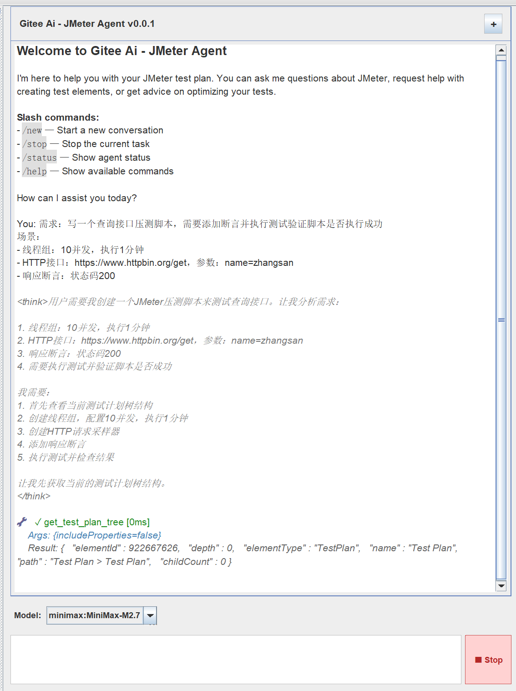

# Gitee Ai - JMeter Agent

[English](README_en.md) | 中文

Gitee Ai 是一个 JMeter AI Agent 插件，通过 Agent Loop 架构驱动 LLM 调用、工具执行与结果反馈的迭代循环，在 JMeter 中实现智能化的测试计划创建、优化和调试。



## 核心特性

- **Agent Loop 架构** — LLM 调用 → 工具执行 → 结果反馈的完整迭代循环，支持多轮工具调用完成复杂任务
- **20+ Agent 工具** — 覆盖 JMeter 元素 CRUD、测试执行、文件系统、Web 搜索、命令执行等场景
- **技能系统** — 从文件系统动态加载技能模块，内置 JMeter 专业知识（60+ 组件参考文档）、API 自动化测试等
- **7 个 AI 提供者** — 支持 DeepSeek、智谱 GLM、Moonshot Kimi、MiniMax
- **组件 Schema 校验** — 46 个 YAML Schema 文件，为 JMeter 组件参数提供类型、必填、枚举、范围等校验
- **记忆系统** — 双层记忆架构（长期记忆 + 事件历史），支持跨会话记忆整合
- **安全控制** — 文件访问白名单、SSRF 防护、危险命令拦截
- **链路追踪** — 可选 LangSmith 集成，提供 LLM 调用追踪与监控
- **Claude Code 集成** — 内嵌终端，可在 JMeter 中直接使用 Claude Code CLI

## 架构概览

```
用户消息
  ↓
CommandRouter（命令路由）
  ↓
AgentLoop（主循环）
  ├── ContextBuilder（构建上下文）
  ├── LLM API 调用（Claude / OpenAI / Ollama / ...）
  ├── ToolRegistry（工具注册中心）
  │   ├── JMeter Element Tools（元素 CRUD）
  │   ├── Test Execution Tools（测试运行/状态/结果）
  │   ├── Filesystem Tools（文件读写编辑）
  │   ├── Web Tools（搜索/抓取）
  │   └── Exec Tool（命令执行）
  ├── SkillsLoader（技能加载）
  ├── MemoryStore（记忆存储）
  └── SessionManager（会话管理）
  ↓
响应输出到 Chat UI
```

**工具调用流程：** LLM 决定调用工具 → ToolRegistry 查找并执行 → SchemaBasedPropertyHandler 校验参数 → 结果反馈给 LLM → 继续迭代或返回最终响应

## 安装

### 环境要求

- **JMeter** 5.6.3
- **JDK** 17 或更高版本

### 手动安装
1. 将 `jmeter-agent-xxx.jar` jar包放到 `jmeter/lib/ext` 目录下

## 快速开始

1. **配置 API Key** — 在 `user.properties` 中设置你的 AI 提供者密钥，例如：
   ```properties
   # 使用 MiniMax（默认提供者）
   minimax.api.key=your-api-key

   # 或使用 Anthropic Claude
   anthropic.api.key=your-api-key
   jmeter.ai.default.provider=anthropic
   ```
2. **打开聊天面板** — 右键 `Add > Non-Test Elements > Gitee Ai`
3. **开始对话** — 直接描述你的需求，例如"创建一个包含 10 个线程的线程组，发送 GET 请求到 http://example.com"

## Agent 工具

### JMeter 元素工具（默认启用）

| 工具名 | 说明 |
|--------|------|
| `create_jmeter_element` | 创建 JMeter 元素（线程组、采样器、控制器、断言、定时器等） |
| `update_jmeter_element` | 更新已有元素的属性 |
| `delete_jmeter_element` | 删除指定元素（不可删除 TestPlan 根节点） |
| `move_jmeter_element` | 移动元素到不同父节点，支持精确位置控制 |
| `get_test_plan_tree` | 获取完整测试计划树结构（JSON） |
| `get_selected_element` | 获取当前选中元素的详细信息 |
| `find_element` | 按名称、类型或路径查找元素 |

### AI 增强工具

| 工具名 | 说明 |
|--------|------|
| `optimize_jmeter_element` | AI 分析并优化选中元素的配置 |
| `lint_jmeter_elements` | AI 重命名元素以改善可读性和组织性 |
| `get_usage` | 查看 Token 使用统计 |

### 测试执行工具

| 工具名 | 说明 |
|--------|------|
| `run_test` | 启动、停止或关闭当前测试计划 |
| `get_test_status` | 获取测试执行状态（运行状态、线程进度、采样数） |
| `get_test_results` | 获取测试结果（响应时间、吞吐量、错误率） |

### 实用工具

| 工具名 | 说明 |
|--------|------|
| `wrap_http_samplers` | 将连续 HTTP 采样器包装到事务控制器下 |

### 文件系统工具（需启用）

| 工具名 | 说明 |
|--------|------|
| `read_file` | 读取文件内容，支持分页 |
| `write_file` | 写入文件，自动创建目录 |
| `edit_file` | 编辑文件（字符串替换） |
| `list_dir` | 列出目录内容，支持递归 |

### Web 工具（需启用）

| 工具名 | 说明 |
|--------|------|
| `web_search` | 搜索互联网（支持 Brave、Tavily、DuckDuckGo 等搜索引擎） |
| `web_fetch` | 抓取网页内容，自动去除导航和广告 |

### 命令执行工具（需启用）

| 工具名 | 说明 |
|--------|------|
| `exec` | 执行 Shell 命令，支持超时和工作目录配置 |

## 命令

### @ 命令

在聊天输入框中使用，以 `@` 前缀触发：

| 命令 | 说明 |
|------|------|
| `@this` | 获取当前选中元素的详细信息，可结合自然语言提问 |
| `@optimize` | AI 分析并优化当前选中元素的配置 |
| `@lint` | AI 重命名元素以改善组织性，支持撤销/重做 |
| `@wrap` | 将 HTTP 采样器智能分组到事务控制器下 |
| `@usage` | 查看 Token 使用统计和费用信息 |

### / 命令

斜杠命令，用于会话管理：

| 命令 | 说明 |
|------|------|
| `/new` | 开始新对话（清空当前会话） |
| `/stop` | 取消当前会话的所有活跃任务 |
| `/status` | 显示 Bot 状态（版本、模型、Token 用量、会话信息） |
| `/help` | 显示可用命令列表 |

## 技能系统

Agent 通过文件系统动态加载技能模块，每个技能包含 `SKILL.md` 定义和可选的 `references/` 参考文档。

| 技能 | 说明 |
|------|------|
| **jmeter** | JMeter 核心技能 — 60+ 组件参考文档、46 个参数 Schema、JMeter 函数参考、编码规范、反模式指南 |
| **api-autotest** | API 自动化测试 — 针对 Gitee-Scan OpenAPI 的专用技能，覆盖 25+ 接口 |
| **memory** | 记忆管理 — 双层记忆（MEMORY.md 长期记忆 + HISTORY.md 事件历史），支持 grep 检索 |
| **skill-creator** | 技能创建 — 元技能，用于创建和更新新的 Agent 技能 |

## 配置参考

将 `jmeter-ai-sample.properties` 的内容复制到 `user.properties`，按需修改。

### 全局 LLM 默认配置

以下配置适用于所有 AI 提供者（除非被提供者专属配置覆盖）：

| 属性 | 说明 | 默认值 |
|------|------|--------|
| `jmeter.ai.temperature` | 温度参数（0.0-1.0），越低越确定性 | `0.7` |
| `jmeter.ai.max.tokens` | 单次响应最大 Token 数 | `65536` |
| `jmeter.ai.max.history.size` | 对话历史保留条数 | `10` |
| `jmeter.ai.reasoning.effort` | 推理强度：none / low / medium / high | `none` |
| `jmeter.ai.default.model` | 默认模型 | `MiniMax-M2.7` |
| `jmeter.ai.default.provider` | 默认提供者 | `minimax` |
| `jmeter.ai.context.window.tokens` | 上下文窗口大小 | `102400` |
| `jmeter.ai.max.tool.iterations` | 单次 Agent 循环最大工具迭代数 | `50` |

### 提供者配置

#### Anthropic (Claude)

| 属性 | 说明 | 默认值 |
|------|------|--------|
| `anthropic.api.key` | API 密钥 | 必填 |
| `anthropic.api.base.url` | API 基础 URL | `https://api.anthropic.com` |
| `anthropic.log.level` | 日志级别（info / debug） | 空（禁用） |

#### OpenAI

| 属性 | 说明 | 默认值 |
|------|------|--------|
| `openai.api.key` | API 密钥 | 必填 |
| `openai.api.base.url` | API 基础 URL | `https://api.openai.com` |
| `openai.log.level` | 日志级别 | 空（禁用） |

#### Ollama（本地）

| 属性 | 说明 | 默认值 |
|------|------|--------|
| `ollama.enabled` | 是否启用 | `false` |
| `ollama.host` | 服务地址 | `http://localhost` |
| `ollama.port` | 服务端口 | `11434` |
| `ollama.thinking.mode` | 思考模式（ENABLED / DISABLED） | `DISABLED` |
| `ollama.thinking.level` | 思考深度（LOW / MEDIUM / HIGH） | 跟随全局设置 |
| `ollama.request.timeout.seconds` | 请求超时（秒） | `120` |

#### 国产大模型

| 属性 | 说明 | 默认值 |
|------|------|--------|
| `deepseek.api.key` | DeepSeek API 密钥 | — |
| `zhipu.api.key` | 智谱 GLM API 密钥 | — |
| `moonshot.api.key` | Moonshot Kimi API 密钥 | — |
| `minimax.api.key` | MiniMax API 密钥 | — |

每个提供者均支持 `*.api.base.url` 配置自定义端点，以及 `*.temperature`、`*.max.history.size` 等覆盖全局默认值。

### Agent Loop 配置

| 属性 | 说明 | 默认值 |
|------|------|--------|
| `agent.enabled` | 启用 Agent Loop | `true` |
| `agent.tool.result.max.chars` | 工具结果截断长度 | `16000` |
| `agent.workspace.path` | 工作空间路径 | `jmeter-agent` |

### 记忆配置

| 属性 | 说明 | 默认值 |
|------|------|--------|
| `agent.memory.enabled` | 启用记忆系统 | `true` |
| `agent.memory.consolidation.threshold` | 记忆整合触发阈值（0.0-1.0） | `0.5` |

### 会话配置

| 属性 | 说明 | 默认值 |
|------|------|--------|
| `agent.session.timeout` | 会话超时时间（毫秒） | `3600000`（1 小时） |
| `agent.session.max.sessions` | 最大活跃会话数 | `100` |

### 工具配置

#### JMeter 工具

| 属性 | 说明 | 默认值 |
|------|------|--------|
| `agent.tools.jmeter.enabled` | 启用 JMeter 工具 | `true` |

#### 文件系统工具

| 属性 | 说明 | 默认值 |
|------|------|--------|
| `agent.tools.filesystem.enabled` | 启用文件系统工具 | `true` |
| `agent.tools.filesystem.allowed.dirs` | 允许访问的目录（逗号分隔） | 用户主目录 |
| `agent.tools.filesystem.denied.dirs` | 禁止访问的路径（逗号分隔） | — |

#### Web 搜索工具

| 属性 | 说明 | 默认值 |
|------|------|--------|
| `agent.tools.websearch.enabled` | 启用 Web 工具 | `true` |
| `agent.tools.websearch.provider` | 搜索引擎（brave / tavily / duckduckgo / jina / serpapi） | `brave` |
| `agent.tools.websearch.max.results` | 最大搜索结果数 | `10` |
| `agent.tools.websearch.timeout` | 搜索超时（秒） | `30` |
| `agent.tools.webfetch.max.length` | 网页抓取最大长度（字符） | `50000` |
| `agent.tools.web.ssrf.protection` | SSRF 防护 | `true` |

#### 命令执行工具

| 属性 | 说明 | 默认值 |
|------|------|--------|
| `agent.tools.exec.enabled` | 启用命令执行工具 | `true` |
| `agent.tools.exec.timeout` | 默认超时（秒） | `60` |
| `agent.tools.exec.working.dir` | 限定工作目录 | — |
| `agent.tools.exec.deny.patterns` | 危险命令拦截规则（正则） | 内置默认规则 |

### 聊天 UI 配置

| 属性 | 说明 | 默认值 |
|------|------|--------|
| `ai.chat.show.tool.calls` | 显示工具调用信息 | `true` |
| `ai.chat.show.thinking` | 显示模型思考内容 | `false` |
| `ai.chat.tool.result.max.length` | 工具结果显示最大长度 | `500` |

### 链路追踪配置

| 属性 | 说明 | 默认值 |
|------|------|--------|
| `langsmith.enabled` | 启用 LangSmith 追踪 | `false` |
| `langsmith.api.key` | LangSmith API 密钥 | — |
| `langsmith.project.name` | 项目名称 | `jmeter-ai` |
| `langsmith.endpoint` | API 端点 | `https://api.smith.langchain.com` |

## API 配置指南

### 国产大模型

| 提供者 | 获取 API Key |
|--------|-------------|
| DeepSeek | [platform.deepseek.com](https://platform.deepseek.com) |
| 智谱 GLM | [open.bigmodel.cn](https://open.bigmodel.cn) |
| Moonshot Kimi | [platform.moonshot.cn](https://platform.moonshot.cn) |
| MiniMax | [api.minimax.com](https://api.minimax.com) |

## 免责声明

- **AI 局限性：** AI 可能产生错误信息，请在生产环境中验证所有建议
- **备份测试计划：** 在实施 AI 建议的大规模修改前，务必备份测试计划
- **API 费用：** 使用 API 会产生 Token 费用，请关注用量
- **安全：** 不要在对话中分享敏感信息（凭证、专有代码等）
- **性能影响：** 部分 AI 建议的配置可能影响测试性能，请监控资源使用

## 许可证

Apache License 2.0
